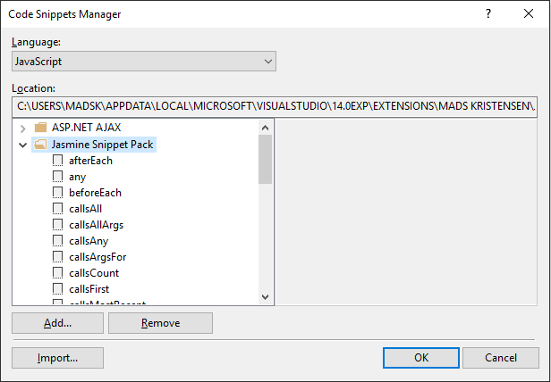

## Jasmine Snippet Pack for Visual Studio

Download this extension from the
[VS Gallery](https://visualstudiogallery.msdn.microsoft.com/423eb4a3-215f-4a8f-9287-1512618ffda3)
or get the
[nightly build](http://vsixgallery.com/extension/4b57f448-ba2e-4404-a0f7-ab1fac14daba/).

-----------------------------------------

A snippet pack to make you more productive working with the
Jasmine test library.
Based on the awesome [sublime-jasmine](https://github.com/NicoSantangelo/sublime-jasmine) package.

This extension ships a bunch of useful code snippets for
the JavaScript editor. Get an overview from the
**Code Snippet Manager** in Visual Studio located under
the **Tools** top level menu.

Here's the full list of all the snippets:

### Specs
| Trigger      | Content |
| -------:     | ------- |
| `desc`      | describe method |
| `xdesc`     | xdescribe method |
| `fdesc`     | fdescribe method |
| `it`        | it method |
| `xit`       | xit method |
| `fit`       | fit method |
| `afterEach` | after each method |
| `beforeEach`| before each method |

### Expectations
| Trigger  | Content |
| -------: | ------- |
| exp 	   | expect |
| tb      | expect().toBe |
| tbct    | expect().toBeCloseTo |
| tbd     | expect().toBeDefined |
| tbf     | expect().toBeFalsy |
| tbgt    | expect().toBeGreaterThan |
| tblt    | expect().toBeLessThan |
| tbn     | expect().toBeNul |
| tbt     | expect().toBeTruthy |
| tbu     | expect().toBeUndefined |
| tc      | expect().toContain |
| te      | expect().toEqual |
| thbc    | expect().toHaveBeenCalled |
| thbcw   | expect().toHaveBeenCalledWith |
| tm      | expect().toMatch |
| tt      | expect().toThrow |
| tte     | expect().toThrowError |
| nb      | expect().not.toBe |
| nct     | expect().not.toBeCloseTo |
| nd      | expect().not.toBeDefined |
| nf      | expect().not.toBeFalsy |
| ngt     | expect().not.toBeGreaterThan |
| nlt     | expect().not.toBeLessThan |
| nn      | expect().not.toBeNull |
| nt      | expect().not.toBeTruthy |
| nu      | expect().not.toBeUndefined |
| nc      | expect().not.toContain |
| ne      | expect().not.toEqual |
| nm      | expect().not.toMatch |
| nt      | expect().not.toThrow |
| any     | jasmine.any |
| oc      | jasmine.objectContaining |

### Spies
| Trigger  | Content |
| -------: | ------- |
|so       | spyOn |
|sct      | spyOn.and.callThrough |
|scf      | spyOn.and.callFake |
|srv      | spyOn.and.returnValue |
|ss       | spyOn.and.stub |
|ste      | spyOn.and.throwError |
|ca       | spy.calls.all |
|caa      | spy.calls.allArgs |
|ca       | spy.calls.any |
|caf      | spy.calls.argsFor |
|cc       | spy.calls.count |
|cf       | spy.calls.first |
|cmr      | spy.calls.mostRecent |
|cr       | spy.calls.reset |
|cs       | createSpy |
|cso      | createSpyObj |
